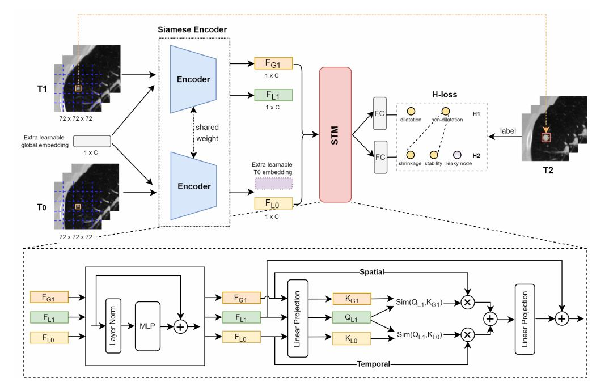

# TS-Mixer

## Introduction
This repository is an implementation of the paper '[Siamese Encoder-based Spatial-Temporal Mixer for Growth Trend Prediction of Lung Nodules on CT Scans](http://xxxxx.pdf)', accepted by MICCAI2022, and is built upon [DeiT](https://github.com/facebookresearch/deit), thank them very much!

<div align="center">
  
</div>
<p align="center">
  Schematic of our proposed method, including a siamese encoder,  a spatial-temporal mixer (STM) and a two-layer H-loss.
</p>


## Usage

### Training:
Run

`python main_ddp.py --resume --gpu 1,2 --batch-size 16 --epochs 60 --distributed`

### Inference:
Run 

`python inference.py`

## Datasets
### The pipeline of organizing the temporal CT dataset.
<div align="center">
  
</div>
<p align="center">
  The pipeline of organizing the temporal CT dataset (NLSTt), including CT scan registration, ROI pairing, and class annotation. The letter d denotes the diameter of lung nodules, and c indicates their corresponding texture types, i.e., solid, part-solid (PS), ground-glass nodule (GGN).
</p>

### Statistics of benchmark splits of the NLSTt dataset and in-house dataset.
| Types | Train set | Validation set | Test set | In-house set |
| ----- |  :----:   | :----:         |:----:    |:----:        |
| GGN   | 2,683     |    564         |658       |129           |
| Solid | 4,121     |    900         |892       |352           |
| PS    | 148       |    26          |37        |6             |
| Total | 6,952     |    1,490       |1,587     |487           |


## Results
### AUC (in %) of different mixers and encoders on the test and in-house sets.
| Encoder | Mixer | Test Set AUC@H1 | Test Set AUC@H2 | In-house set AUC@H1 | In-house set AUC@H2 |
| ----- | :----:  | :----: |:----: |:----: |:----: |
CNN |Concat     |80.8 |75.3 | 67.2 | 67.2 |
CNN |LSTM       |81.8 |75.0 | 64.0 | 71.0 |
CNN |STM (Ours) |83.0 |76.3 | 73.5 | 71.6 |
ViT |Concat     |82.6 |75.2 | 64.2 | 64.1 |
ViT |LSTM       |82.6 |76.3 | 67.1 | 74.7 |
ViT |STM (Ours) |83.6 |77.5 | 72.8 | 78.5 |

### ACC of nodule types of the test set on different methods.
| Method | ACC-GGN | ACC-Solid |ACC-PS |
| -----  | :----:  | :----:    |:----: |
| CNN+STM| 90.9    | 88.2      |56.8   |
| ViT+STM| 92.4    | 91.6      |59.5   |

### ACC of nodule types of in-house set on different methods.
| Method | ACC-GGN | ACC-Solid |ACC-PS |
| -----  | :----:  | :----:    |:----: |
| CNN+STM| 87.6    | 91.2      |58.1   |
| ViT+STM| 93.8    | 90.6      |60.5   |
| Clinician A| 85.3    | 93.2      |60.5   |
| Clinician B| 86.0    | 94.0      |62.8   |

## Examples of predicting the growth trend by our model.
<div align="center">
  
</div>
<p align="center">
  Examples of predicting the growth trend by our model and clinicians A and B. The first row is the ground-truth of the evolution classes, and the predicted results in red color are the incorrect predictions. The symbols →, ↑, and ↓ denote the classesstability, dilatation and shrinkage, respectively.
</p>

## License
This repository is released under the Apache 2.0 license as found in the [LICENSE](LICENSE) file.

## Citation

Please cite TS-Mixer in your publications if it helps your research. 

```

```
